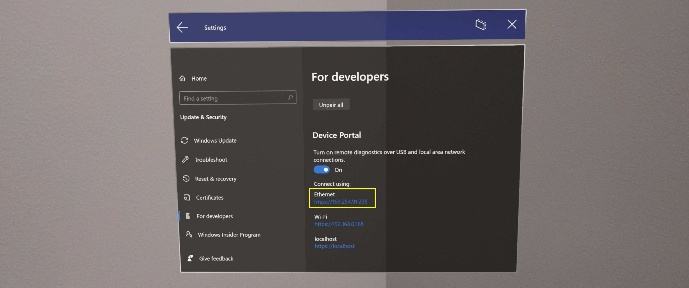
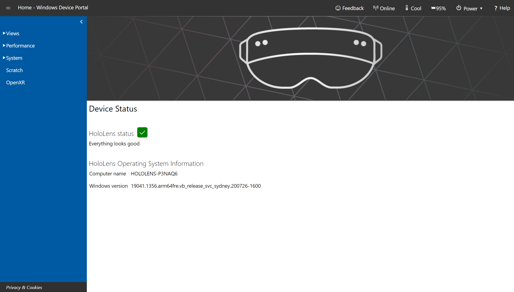
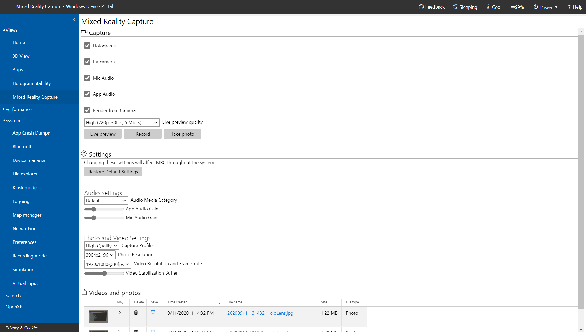
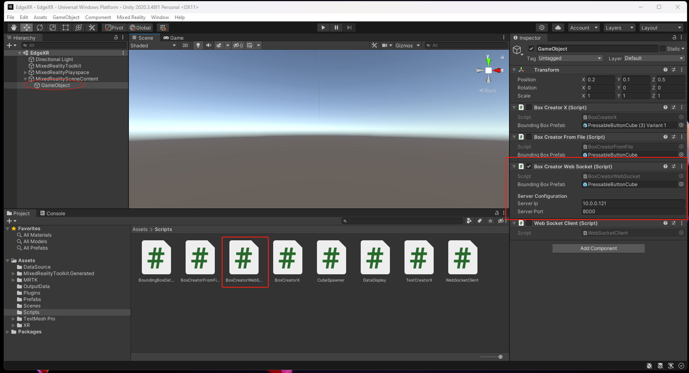
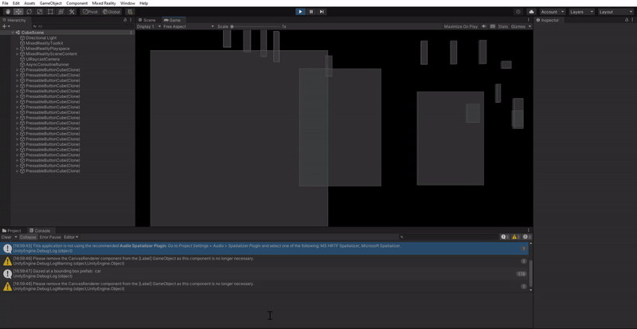
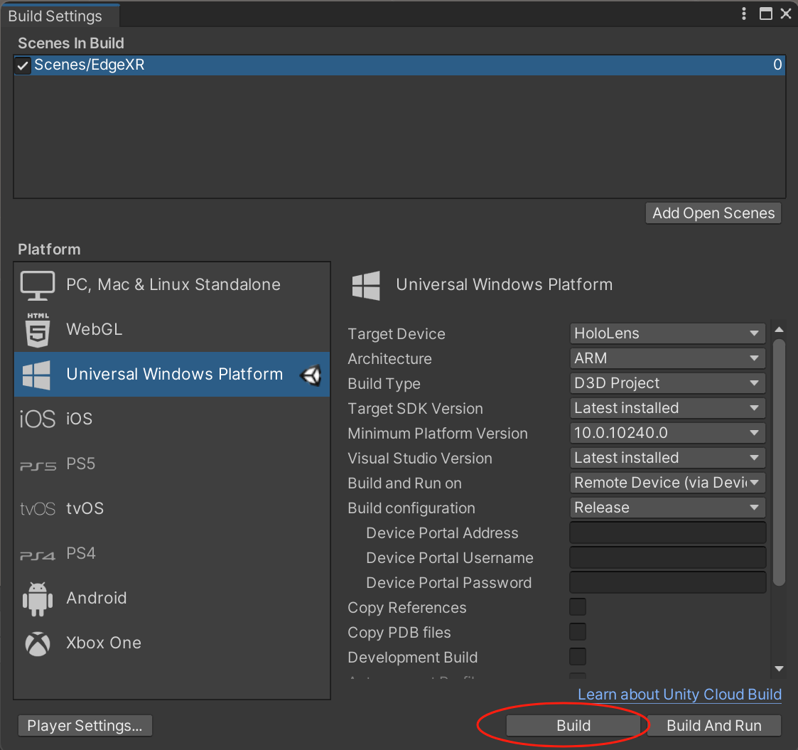
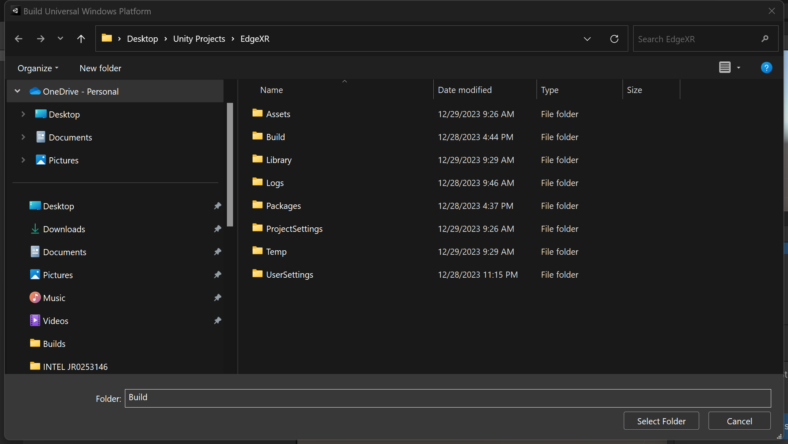
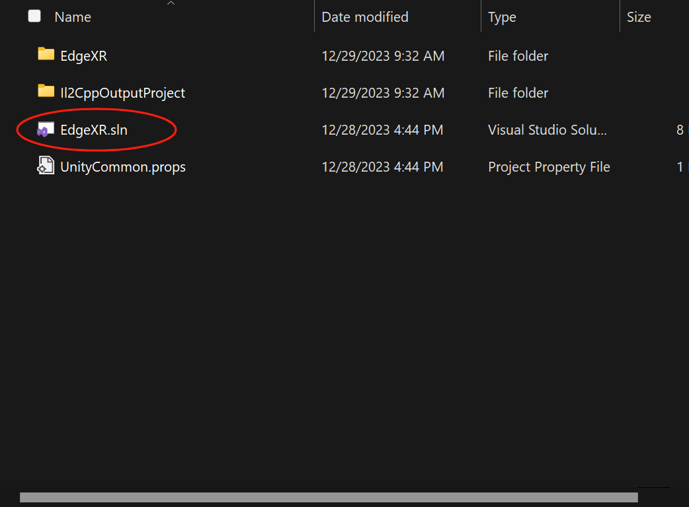
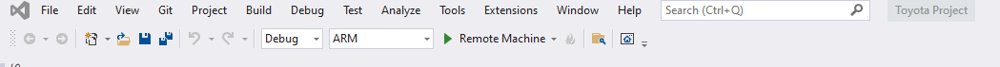
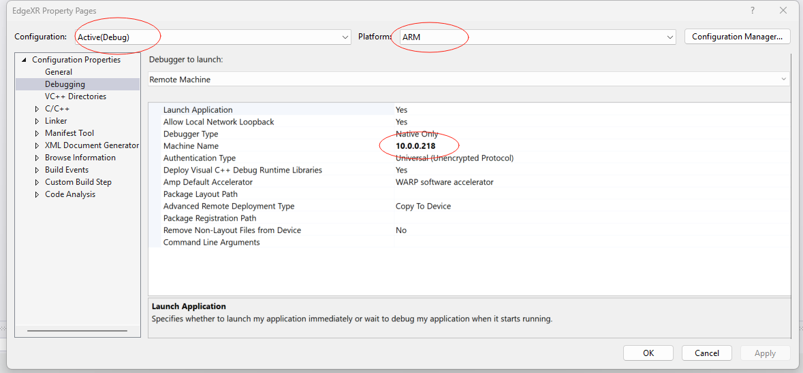

# Edge Computing in AR Integrated Autonomous Vehicles

## Summary

In our internship project, we investigate the significant benefits that edge computing introduces in the AR integrated autonomous vehicle computation offloading. We have developed an object detection model and an eye tracking model to form the basis of our computations that need to be performed locally and with the assistance of an edge server. We measure and record various computation resource utilization such as CPU, bandwidth, energy consumption, and latency from executing these various computations locally and with the help of edge computing.

Our updated project can be obtain from the link: [EdgeXR OneDrive](https://uofh-my.sharepoint.com/:f:/r/personal/dmdoe_cougarnet_uh_edu/Documents/EdgeXR%20Update?csf=1&web=1&e=H0hohM)

## Project Components

1. **Server Side**: Consists of our object detection model.
2. **Client Side**: Consists of our HoloLens 2 device.

## Server-Side Object Detection (MacBook Setup)

We run the YOLOv8 model on the server side, which receives camera frames from the HoloLens to perform object detection. The detected object information is then transmitted to the HoloLens for rendering.

## Server Code (server_update.py)

- [server_update.py](Object Detection Server Side/server_update.py): This code is responsible for running the object detection model on the server side.
- NB: Please configure the server IP and Host based on the Macbook's IP and you can keep the host as 8000 (This will be used in our client side for connection and data transfer).

## Preliminaries

Before running the server code, make sure to install the necessary Python packages (especially pip install uuid), especially YOLOv8, Detect, Segment, and Pose models. These models are pretrained on the COCO dataset and can be obtained from [ultralytics/ultralytics](https://github.com/ultralytics/ultralytics).

## Configuring the HoloLens Device Portal

To configure the HoloLens device portal for streaming:

1. Connect your HoloLens to Wi-Fi.
2. Obtain your device's IP address through the device's network settings.


3. Open a web browser on your PC and go to `https://<YOUR_HOLOLENS_IP_ADDRESS>`.


4. Ignore any security certificate warnings.
5. Create or enter a username and password.
6. Navigate to `View -> Mixed Reality Capture -> Live preview`.


7. Right-click to copy the live stream link and replace the stream link in the `server.py` code.

## Running the Server Code

After configuring the HoloLens device portal and updating the stream link in `server.py`, run the following command to start the server:

```bash
python server.py
``````

# AR Integrated Autonomous Vehicle Computation Offloading - Client Side (Windows Setup)

In this section, we'll guide you through setting up and using the client side of our AR Integrated Autonomous Vehicle Computation Offloading project. The client side is developed in Unity and is designed to receive object detection data from the server.

## Table of Contents
- [Introduction](#introduction)
- [Getting Started](#getting-started)
- [Usage](#usage)
- [Future Plans](#future-plans)

## Introduction

In our internship project, we investigate the significant benefits that edge computing introduces in AR integrated autonomous vehicles' computation offloading. This section focuses on the client side of the project, which is responsible for receiving object detection data from the server.

We provide a UUID that uniquely identifies detected objects from the server and their corresponding paths for data retrieval purposes, facilitating easy searching and retrieval of data associated with these objects.

## Getting Started

To set up the client side of the project, follow these steps:

1. **Download the Project:**
   - We have provided the necessary Unity project files, including scripts and assets, on OneDrive for your convenience.
   - Download the complete project from the OneDrive link provided by the team.

2. **Copy Files and Folders (Skip step if you downloaded project from OneDrive):**
   - Copy the `BoxCreatorWebSocket.cs` file into the `Assets/Scripts` folder of your Unity project.
   - Replace the `BoundingBoxes` scene in the `Assets/Scenes` folder with the provided scene.
   - Replace the `Prefabs` folder in the `Assets/Prefabs` directory with the provided Prefabs folder.
   - Similarly, copy the `Plugins` folder into the `Assets/Prefabs` folder or follow the provided instructions for downloading the entire project.

3. **Editing the project:**
   - In Unity Hub, Open add new project from disk and navigate to select the extracted project (EdgeXR).
   - Download the required unity version to open the code if you have to and if the code opens, select scene from the `Assets -> Scene -> EgdeXR` in the Project menu. 
   - With the EdgeXR scene selected, locate the Scriptsv folder in Project menu `Assets -> Scripts` and find the script `BoxCreatorWebSocket.cs`, open this script and change the `ServerIP` and `ServerPort` with the MacBook Server IP respectively.
   - In the Hierarchy menu, locate MixedRealitySceneContent, dropdown and select the GameObject to check if the script `BoxCreatorWebSocket.cs` is added and network configuration is correct as well.


4. **Build the Solution:**
   - You want to run the application using unity first to make sure it works before building.
   - Setup the server and after editing the server IP and Port, hit the play to simulate the demo in unity first before building a solution. you should obtain this: 
   
   - In Unity, select `File -> Build Settings -> Build` to build a solution for the project to deploy on the HoloLens.
   
   - Build project into the Build folder shown in the folders here:
   
   - NB: Ensure you have only the EdgeXR scene added in your Scenes In Build, if there are other scenes, remove all of them `Ctrl+A` then `Backspace(delete)` and then select the Add Open Scences button.

5. **Visual Studio Configuration:**
   - Navigate to the `Build` folder and open the solution file in Visual Studio.
   
   - Configure Visual Studio for either `DEBUG` or `RELEASE` and set the architecture to `ARM` and select device not Remote Machine.
   
   - Build and run the application on your HoloLens device.
   - NB: Hololens should be connected to the PC and Debug will log the eye tracking and server data but release will not. To configure the Remote Machine, Select the EdgeXR Debug properties and find the Debugging option. Add the Hololens IP address in the `Machine Name` section.
   

## Usage

Once you have successfully deployed the application on your HoloLens device, follow these steps:

1. **Start the Server:**
   - Run the server on the MacBook to initiate object detection. Ensure that the server is up and running.

2. **Run the HoloLens Application:**
   - Hit the play button in Visual Studio to deploy the application on your HoloLens.
   - Once deployed, you can test the object detection and eye tracking project
   - Exit the application on the HoloLens when you finish testing.

3. **Client Operation:**
   - Enjoy the demo as the HoloLens receives and displays object detection data from the server.

## Future Plans

As we continue to develop this project, we have several future plans in mind:

1. **Enhanced Object Rendering:**
   - Add functionalities to render sample Unity assets that represent the class names in a dialog box, along with the object ID and path for retrieval.

2. **Improved User Interface (UI):**
   - Improve the user interface by including a landing page and implementing robust error handling and extensive simulation features.

3. **Integration with Eye Tracking:**
   - Implement functionalities that utilize eye tracking information, such as sending information to the edge server to start or stop object detection based on user gaze.

4. **Voice Commands:**
   - Implement voice commands in addition to eye tracking, enhancing the user experience and control options.

These future plans aim to make the project more versatile, user-friendly, and suitable for a wide range of use cases.

Please feel free to contact us with any questions or feedback regarding this project.

---

**Contributors:**
- [Your Name]
- [Contributor 2 Name]
- [Contributor 3 Name]
- ...

**License:**
This project is licensed under the [License Name]. See the LICENSE file for details.

**Acknowledgments:**
- [Acknowledgment 1]
- [Acknowledgment 2]
- ...
